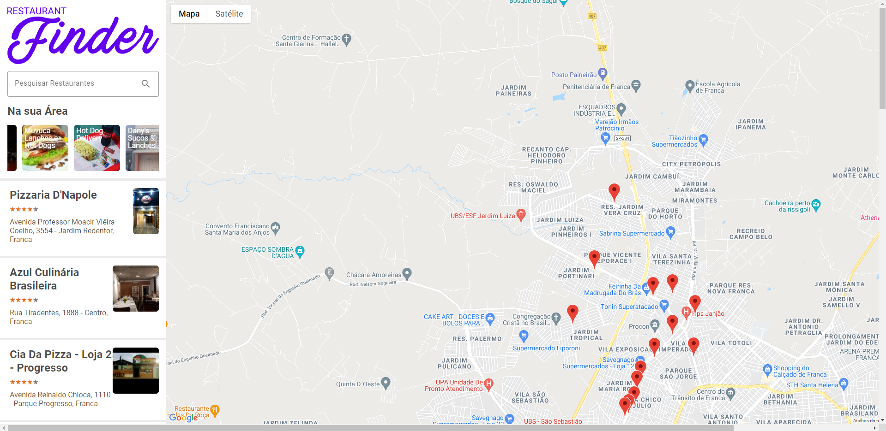

<p align="center">
  
</p>

## :bookmark: About the project

ReactJS - Application created to find restaurants nearby the user's location, developed at DIO Bootcamp Impulso React Web Developer.

## 🚀 Technologies

Technologies that I used to develop this web client

- [Create React App](https://github.com/facebook/create-react-app)
- [React.JS](https://pt-br.reactjs.org/)
- [Styled Components](https://styled-components.com/)
- [Lottie](https://lottiefiles.com/)
- [Redux](https://redux.js.org/introduction/getting-started)
- [React Slick](https://react-slick.neostack.com/)
- [Babel](https://babeljs.io/docs/en/)
- [ESLint](https://eslint.org/docs/user-guide/getting-started)
- Environment variables

## 💻 Getting started

### Requirements

**Clone the project and access the folder**

```bash
$ git clone https://github.com/igormazetti/RepositorySeeker.git && cd RestaurantSearch
```

**Follow the steps below**

```bash
# Install the dependencies
$ yarn
```

Run the project

```bash
$ yarn start
```

- For the project to work, you will need to create new credentials as API key at google API,
  referent to google Maps API and google Places API.

---

Made by Igor Mazetti 👋 [See my linkedin](https://www.linkedin.com/in/igor-mazetti-de-azevedo-147679ba/)
